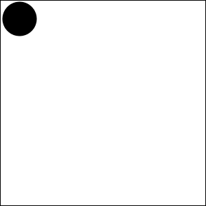
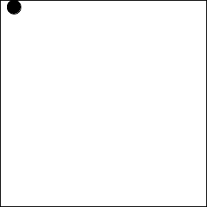
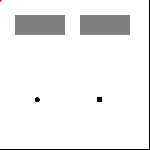
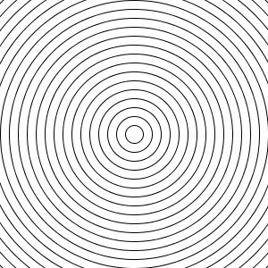
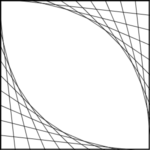
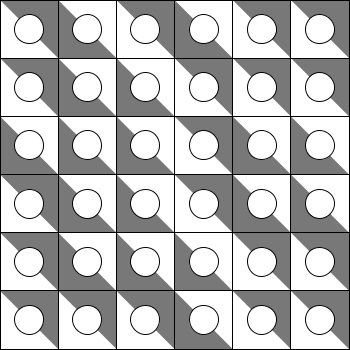
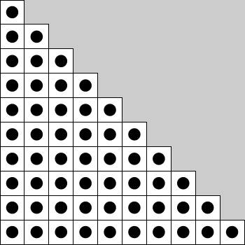
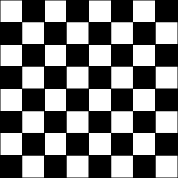

# Tarea 03. Fundfamentos de programación

### Instrucciones

Esta tarea se divide en 4 secciones: [Variables](#variables), [Condicionales](#condicionales), [Iteraciones](#iteraciones) y [Funciones](#funciones).

Cada una de estas secciones tiene ejercicios:

- Las respuestas de esta tarea se debe subir a Brightspace.
- Los ejercicios marcados como `js`, se deben responder con un enlace de [https://codesandbox.io/](CodeSandbox).
- En caso contrario, se debe subir un archivo o texto respondiendo lo que se pida.

En caso de tener alguna duda, no olvides enviar un correo.

## Variables

## Condicionales

1. `js` **Horizontal y Vertical**. Crea un sketch con dos elipses. Una recorre en horizontal, y cada vez que llega al ancho baja en la pantalla. Y la otra recorre el eje vertical, y cada vez que llega a la altura, se desplaza a la derecha.

2. `js` **Bouncing Ball**. Crea un sketch con una elipse que rebota sin salirse del canvas. Es la misma que vimos en clase pero SIEMPRE debe verse completa. 

_Hint: guarda en una variable el tamaño de la elipse_.

3. `js` **Sides**. Crea un sketch con una elipse recorre los lados del canvas a una velocidad guardada en una variable.

_Hint: usa una variable entera para guardar en cuál lado estás_.

4. `js` **GrowButtons**. Crea un sketch con dos botones, uno agranda a un cuadro y el otro a una elipse. (En la muestra el click se ve con un circulo rojo).

## Iteraciones

1. `js` Usa la estrcutura `while` en los siguientes ejercicios:
   1. **Circles While**. Crea un sketch que dibuje el patrón:
   
   
   
   2. **Diagonals**. Crea un sketch que dibuje patrón:

   

2. Indica cuales de los siguientes ejemplos de `for` entran en loop infinito. En caso de ser falso, escribe cuales valores toman las variables.

   1. `for()`
   2. `for()`
   3. `for()`
   4. `for()`

4. `js` Repite los sketches del ejercicio 1.0 pero usando la estructura `for`.
5. `js` **Curve**. Usa la estructura `for` para hacer el siguiente patrón:

4. Realiza los siguientes ejercicios usando dos `for` anidados:
   1. **Crosses**. Haz el siguiente patrón:
   
   
   
   2. **Mosaic**. Crea un mosaico como el que sigue, de tal forma que en cada cuadro aparezca un dibujo de dos posibles, de forma aleatoria. _Hint: usa_ `int coin = floor(random(2))` _para generar un número aleatorio que sea_ `0` _o_ `1`. 
   
   
   
5. Elije alguno de los siguientes ejercicios:
   1. **Piramid**. Crea el siguiente patrón (se hace con dos `for` anidados:
   
   
   
   2. **Chessboard**. Crea el siguiente patrón.
   
   
   
   3. **TripleFor**. Crea el siguiente patrón usando tres `for` anidados:
   
   
   
   4. **CustomMosaic**. Haz el ejercicio 5.ii con dos de tus diseños propios.

## Funciones
